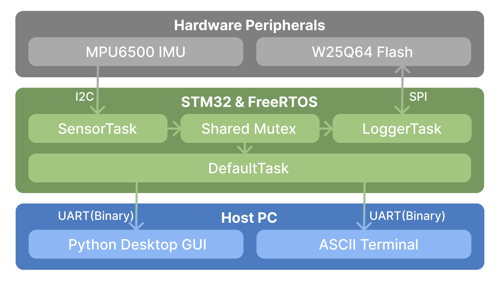

# STM32 Freertos Peripheral System


## Project Overview
An end-to-end embedded data acquisition system built on the STM32F103 microcontroller. This project demonstrates deterministic multi-tasking using **FreeRTOS**, custom peripheral drivers (I2C/SPI), and non-volatile memory management. 

A core feature of this system is its **Dual-Mode UART Interface**, which utilizes a deterministic Finite State Machine (FSM) to seamlessly multiplex between a human-readable ASCII Command Shell and a machine-readable Variable-Length Binary Protocol. It is accompanied by a custom Python GUI application for real-time control and telemetry visualization.

## Demo

### 1. Python GUI (Binary Protocol)

*Real-time binary packet parsing. Acceleration updates as the MPU6500 IMU is moved.*

### 2. ASCII Command Shell

*Sending UART commands via CoolTerm to control hardware and Flash operations.*

## Features
* **Real-Time OS Integration:** FreeRTOS Tasks, Queues, and Mutexes ensure thread-safe data sharing between sensor polling and Flash logging.
* **Dual-Mode UART Interface:** Simultaneously supports two communication paradigms on a single serial line.
  * **Interactive ASCII Command Shell:** Outputs human-readable text to standard terminals (e.g., PuTTY/CoolTerm) for manual testing and debugging (`log start`, `led on`).
  * **Deterministic Binary Protocol:** An FSM parses custom variable-length binary packets for communication with the Python Host.
* **Custom SPI Flash Driver (W25Q64):** Hand-rolled driver with 16-byte page-boundary alignment to eliminate cross-page overwrites during continuous logging.
* **Python Desktop GUI:** Event-driven host application using `tkinter` and `pyserial` to send commands, parse telemetry, and display logs without blocking the main thread.

## System Architecture

<p align="center">
  
  <br>
  <i>System data flow from sensor acquisition to dual-mode PC communication.</i>
</p>

### Hardware Architecture
* **Microcontroller:** STM32F103C8T6 (ARM Cortex-M3)
* **IMU Sensor:** MPU6500 (Interfaced via I2C at 400kHz)
* **Storage:** W25Q64 8MB NOR Flash (Interfaced via SPI)
* **Host Interface:** USB-to-TTL Serial Adapter (UART1 at 115200 Baud)

### Software Architecture

#### FreeRTOS Task Design
1.  **SensorTask (High Priority):** Polls the MPU6500 via I2C and updates a Mutex-protected shared data structure.
2.  **LoggerTask (Below Normal Priority):** Locks the Mutex to snapshot sensor data, packages it into a 16-byte aligned struct, and writes it to Flash via SPI Page Program.
3.  **DefaultTask / Shell (Normal Priority):** Consumes bytes from the UART RX Queue. Acts as the router for the Dual-Mode Parser.

#### Custom Binary Protocol Specification
The system uses a custom variable-length binary packet structure.

**Packet Format:**
`[START (1B)] | [CMD (1B)] | [LENGTH (1B)] | [DATA (0-16B)] | [CHECKSUM (1B)]`

* `START`: Fixed synchronization byte (`0xAA`).
* `CMD`: Instruction identifier (e.g., `0x10` for LOG_START).
* `LENGTH`: Number of payload bytes.
* `DATA`: Variable payload (e.g., 16-bit signed accelerometer data).
* `CHECKSUM`: XOR calculation of `CMD`, `LENGTH`, and `DATA`.

## Engineering Challenges & Solutions

### 1. Flash Memory Page Boundary Overwrites

The W25Q64 restricts writes to 256-byte pages. Continuously writing 12-byte log entries caused the address pointer to wrap at the page boundary, corrupting existing data.

Resolved by padding LogEntry_t to 16 bytes with a 4-byte reserved field. 16 divides evenly into 256, so 16 entries pack perfectly into one page with no boundary logic required.

### 2. Thread Safety & Race Conditions in Asynchronous Multi-Tasking

`SensorTask` polls and updates telemetry at 200Hz, while `LoggerTask` snapshots data at 1Hz for Flash storage. Reading the shared data structure mid-update by the I2C polling thread caused race conditions, resulting in partial reads and data corruption.

Resolved by introducing a FreeRTOS Mutex to guard the shared memory. Both the producer (`SensorTask`) and consumers (`LoggerTask`, `DefaultTask`) must acquire the lock before access, ensuring data atomicity across asynchronous execution contexts.

## Future Improvements

**1. Multi-Sector Logging**

Currently limited to a single erased sector. Planned extension to implement a circular buffer across all Flash sectors, with automatic erase-before-write handling at sector boundaries.

**2. DMA-Based Peripheral Transfers**

Replace blocking SPI/I2C HAL calls with DMA-based transfers to free the CPU during peripheral I/O, improving task scheduling responsiveness.

**3. Wear Leveling**

With multi-sector logging in place, a sequential wear leveling scheme will distribute writes evenly across the Flash to extend memory lifespan beyond the W25Q64's rated 100,000 erase cycles per sector.

**4. CRC-16 Packet Validation**

Replace the current XOR checksum with CRC-16/MODBUS to improve burst error 
detection in the binary protocol.

## Getting Started

### Hardware Wiring
**System & Debug (Power & ST-Link)**  
|STM32 Pin|Internal Function / Label|External Connection|
|---|---|---|
|3V3|VCC|All Modules VCC (3.3V)|
|GND|GND|All Modules GND|
|PC13|GPIO_Output (LED)|On-board Green LED|
|PA13|SYS_JTMS-SWDIO|ST-Link SWDIO|
|PA14|SYS_JTCK-SWCLK|ST-Link SWCLK|

**UART1 (Command Shell via USB-TTL)**  
|STM32 Pin|Internal Function / Label|External Connection (USB-TTL)|
|---|---|---|
|PA9|USART1_TX|RX|
|PA10|USART1_RX|TX|
  
**I2C1 (MPU6500 6-Axis IMU)**  
|STM32 Pin|Internal Function / Label|External Connection (MPU6500)|
|---|---|---|
|PB6|I2C1_SCL|SCL|
|PB7|I2C1_SDA|SDA|
  
**SPI1 (W25Q64 NOR Flash)**  
|STM32 Pin|Internal Function / Label|External Connection (W25Q64)|
|---|---|---|
|PA4|GPIO_Output (W25Q64_CS)|CS (Chip Select)|
|PA5|SPI1_SCK|CLK (Clock)|
|PA6|SPI1_MISO|DO (Master In Slave Out)|
|PA7|SPI1_MOSI|DI (Master Out Slave In)|


### Prerequisites
* STM32CubeIDE or VS Code with CMake + GCC ARM Toolchain
* Python 3.8+
* ST-Link V2 Programmer

### Repository Structure

    ├── Core/
    │   ├── Inc/           # C Header files (protocol.h, w25q64.h, sensor_data.h)
    │   └── Src/           # C Source files (freertos.c, protocol.c, w25q64.c)
    ├── scripts/
    │   ├── test_protocol.py   # CLI script for basic FSM testing
    │   └── gui_controller.py  # Python Tkinter Desktop Application
    ├── images/            # Directory for README assets
    ├── CMakeLists.txt     # Build configuration
    └── README.md

### Flashing the Firmware
1. Open the project in STM32CubeIDE.
2. Connect the ST-Link V2 to the SWD pins.
3. Click **Run** to build and flash.

### Running the Python GUI Host
1. Connect the STM32 board via a USB-to-TTL adapter.
2. Navigate to the `scripts` directory.
3. Install dependencies:
   ```bash
   pip install pyserial
4.	Update the PORT variable in gui_controller.py to match your local serial device (e.g., COM3 for Windows, /dev/cu.usbserial-* for macOS).
5.	Launch the application:
    ```bash
    python gui_controller.py
